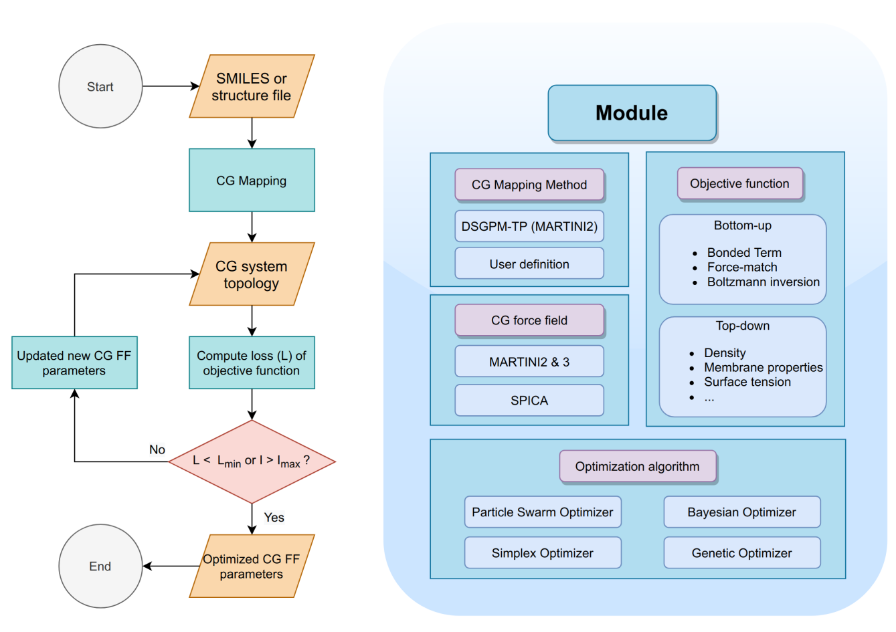

.. _Usage:

Usage Guide
===========

This section provides a step-by-step guide on how to use the AMOFMS tool for CG automated mapping and parameters optimization.

The typical workflow for using AMOFMS involves the following steps:

.. toctree::
   :maxdepth: 1

   usage/Determine_CGFF
   usage/Mapping
   usage/Identify_parameters
   usage/Define_obj
   usage/Select_optimizer
   usage/Run
